##(Generalised) linear (mixed) models with R2jags: an extremely brief primer...##

***Andrew Letten***

***Friday, November 28, 2014***

The purpose of this [ecostats](http://www.eco-stats.unsw.edu.au/) lab is to provide a very basic primer on running basic lm, glm and glmms in a Bayesian framework using the R2jags package (and of course JAGS). As such, the goal is not to debate the relative merits of Bayesian vs frequentist approaches, but hopefully to demystify the fitting of Bayesian models, and more specifically demonstrate that in a wide variety of (more basic) use cases the parameter estimates obtained from the two approaches are typically very similar.

We will be attempting to reproduce a small element of the analysis from a recently published article in *Journal of Ecology* (for which all the data is available at datadryad.org).

Kessler, M., Salazar, L., Homeier, J., Kluge, J. (2014), Species richness-productivity relationships of tropical terrestrial ferns at regional and local scales. *Journal of Ecology*, 102: 1623-1633. http://onlinelibrary.wiley.com/doi/10.1111/1365-2745.12299/abstract

First things first: JAGS, R packages and data.  

If you don't have it already you will need to download JAGS from http://sourceforge.net/projects/mcmc-jags/files/rjags/. 


```r
# required packages
#
# install.packages("lme4")
# install.packages("R2jags")
# install.apckages("runjags")
# install.packages("coefplot2", repos="http://www.math.mcmaster.ca/bolker/R", type = "source")

library(lme4)
library(R2jags)
library(runjags)
library(coefplot2)
```

To obtain the data you can either uncomment the following code block, or alternatively proceed directly to the next block and read in 'KessDiv.csv' which has already been modified into a useable format.


```r
# temp <- tempfile(fileext=".csv")
# download.file(
#   "http://datadryad.org//bitstream/handle/10255/dryad.67401/Kessler Data Table.csv", temp)
# fern.dat <- read.csv(temp, header = TRUE, stringsAsFactors=FALSE)
# rm(temp)
# 
# fern.dat = fern.dat[-1,]
# names(fern.dat) = c("plot", "elev", "tag", "species", 
#                     "N.09", "av.09", "new.10", "N.10", 
#                     "av.10", "new.11", "N.11", "av.11", 
#                     "l.09", "l.10", "l.11", "prod.0910", 
#                     "prod.1011", "rhz.09", "rhz.10", "rhz.11", 
#                     "rhz.w", "rhz.09g", "rhz.10g", "rhz.11g", 
#                     "rhz.prod.0910", "rhz.prod.1011", "arb.09", "arb.10", 
#                     "arb.11", "av.diam", "t.rhz.09", "t.rhz.10",
#                     "t.rhz.11", "t.rhz.prod.0910", "t.rhz.prod.1011")
# 
# fern.dat[,c(16,17,25,26)][is.na(fern.dat[,c(16,17,25,26)])] = 0 # convert productivty NAs to zero
# # length(unique(fern.dat$species)) # 88, but article says 91...
# 
# library(dplyr)
# div = fern.dat %>% 
#   mutate(prod = (as.numeric(prod.1011) + as.numeric(rhz.prod.1011))) %>% 
#   filter(elev != 1500, elev != 3000) %>% # plots at 1500 and 3000 m appear not included?? (fig 1) 
#   group_by(plot, elev) %>% 
#   summarise(length(unique(species)), log(sum(prod)))
# 
# colnames(div)[2:4] = c("elev", "rich", "logprod")
```

Data consists of the fern species richness and productivity sampled at 18 sites nested at 6 different elevations (i.e. three sites at each elevation.


```r
div = read.csv(file = "KessDiv.csv", header = TRUE)

div
```

```
##    plot elev rich logprod
## 1     1 4000    3   5.486
## 2    13 1000   10   5.310
## 3    14 1000    8   5.721
## 4    15 1000    9   5.295
## 5    16  500    9   6.369
## 6    17 4000    3   4.614
## 7    18 3500    6   4.070
## 8    19 4000    3   4.527
## 9     2 2000   14   6.594
## 10   20 3500    6   5.540
## 11   21 3500    5   4.405
## 12    3 2000   22   6.863
## 13    4 2500   20   8.048
## 14    5 2000   17   7.433
## 15    6 2500   19   7.667
## 16    7 2500   16   8.213
## 17    8  500   13   6.339
## 18    9  500   12   6.452
```

```r
div$elev = as.numeric(as.factor(div$elev)) # formatting for JAGS
```

**Hypothesis: There is a significant relationship between fern species richness `div$rich` and fern productivity `div$logprod`.**

*Frequentist approach*


```r
# lm 
mod = lm(rich ~ logprod, data = div) 
summary(mod) # -ve intercept = negative species richness at zero productivity!
```

```
## 
## Call:
## lm(formula = rich ~ logprod, data = div)
## 
## Residuals:
##    Min     1Q Median     3Q    Max 
## -5.454 -1.704  0.579  1.282  7.763 
## 
## Coefficients:
##             Estimate Std. Error t value Pr(>|t|)    
## (Intercept)  -14.584      3.677   -3.97   0.0011 ** 
## logprod        4.199      0.595    7.05  2.7e-06 ***
## ---
## Signif. codes:  0 '***' 0.001 '**' 0.01 '*' 0.05 '.' 0.1 ' ' 1
## 
## Residual standard error: 3.11 on 16 degrees of freedom
## Multiple R-squared:  0.757,	Adjusted R-squared:  0.742 
## F-statistic: 49.8 on 1 and 16 DF,  p-value: 2.72e-06
```

```r
plot(rich ~ logprod, data=div) 
abline(mod)
```

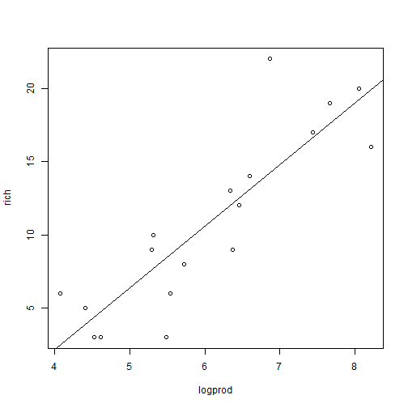 

With a random effect (intercept only) on elevation (NB: only 6 levels with 3 data points in each)


```r
# lmm
Elev = as.factor(div$elev) # back to a factor - not necessary for lmer but doing it here for peace of mind.
mixmod = lmer(rich ~ logprod + (1|Elev), data = div) 
summary(mixmod) # parameter estimates same sign as original paper but different abs value (poss due to how the productivty measure was calculated)
```

```
## Linear mixed model fit by REML ['lmerMod']
## Formula: rich ~ logprod + (1 | Elev)
##    Data: div
## 
## REML criterion at convergence: 87.2
## 
## Scaled residuals: 
##     Min      1Q  Median      3Q     Max 
## -1.3761 -0.5986 -0.0094  0.5593  2.2647 
## 
## Random effects:
##  Groups   Name        Variance Std.Dev.
##  Elev     (Intercept) 3.32     1.82    
##  Residual             7.42     2.72    
## Number of obs: 18, groups: Elev, 6
## 
## Fixed effects:
##             Estimate Std. Error t value
## (Intercept)  -11.857      4.671   -2.54
## logprod        3.749      0.755    4.97
## 
## Correlation of Fixed Effects:
##         (Intr)
## logprod -0.978
```

*JAGS (Bayesian) approach (linear model without random effect)*

First need to bundle data into a JAGS friendly format, starting with the design matix... 

```r
X = model.matrix(~ scale(logprod), data = div) #standardize (scale and centre) predictors for JAGS/BUGS analysis
X
```

```
##    (Intercept) scale(logprod)
## 1            1        -0.4471
## 2            1        -0.5857
## 3            1        -0.2615
## 4            1        -0.5977
## 5            1         0.2497
## 6            1        -1.1351
## 7            1        -1.5639
## 8            1        -1.2037
## 9            1         0.4276
## 10           1        -0.4041
## 11           1        -1.2999
## 12           1         0.6395
## 13           1         1.5741
## 14           1         1.0890
## 15           1         1.2735
## 16           1         1.7045
## 17           1         0.2259
## 18           1         0.3149
## attr(,"assign")
## [1] 0 1
```

A brief aside - remember the goal of regression is to find the best solution (parameters) to a series of linear equations (deterministic part) assumming our response is a random variable following some probability distribution (stochastic part): 


```r
# deterministic & stochastic part 
data.frame("y" = div$rich, 
           "int" = paste(rep("  =  beta1", times = 18), "*", X[,1]), 
           "beta" = rep("  +   beta2 *", times = 18), 
           "x" = X[,2],
           "residuals" = paste("+   e", 1:18, sep = ""), 
           row.names = paste("Obs", 1:18, "      ", sep = ""))
```

```
##              y            int          beta       x residuals
## Obs1         3   =  beta1 * 1   +   beta2 * -0.4471    +   e1
## Obs2        10   =  beta1 * 1   +   beta2 * -0.5857    +   e2
## Obs3         8   =  beta1 * 1   +   beta2 * -0.2615    +   e3
## Obs4         9   =  beta1 * 1   +   beta2 * -0.5977    +   e4
## Obs5         9   =  beta1 * 1   +   beta2 *  0.2497    +   e5
## Obs6         3   =  beta1 * 1   +   beta2 * -1.1351    +   e6
## Obs7         6   =  beta1 * 1   +   beta2 * -1.5639    +   e7
## Obs8         3   =  beta1 * 1   +   beta2 * -1.2037    +   e8
## Obs9        14   =  beta1 * 1   +   beta2 *  0.4276    +   e9
## Obs10        6   =  beta1 * 1   +   beta2 * -0.4041   +   e10
## Obs11        5   =  beta1 * 1   +   beta2 * -1.2999   +   e11
## Obs12       22   =  beta1 * 1   +   beta2 *  0.6395   +   e12
## Obs13       20   =  beta1 * 1   +   beta2 *  1.5741   +   e13
## Obs14       17   =  beta1 * 1   +   beta2 *  1.0890   +   e14
## Obs15       19   =  beta1 * 1   +   beta2 *  1.2735   +   e15
## Obs16       16   =  beta1 * 1   +   beta2 *  1.7045   +   e16
## Obs17       13   =  beta1 * 1   +   beta2 *  0.2259   +   e17
## Obs18       12   =  beta1 * 1   +   beta2 *  0.3149   +   e18
```

We can also write these equations in a more simple form using vectors and matrices, where we have a a vector consisting of the paramaters (betas) and and the matrix is the design matrix `X` we get from `model.matrix`. In the second example, we'll take advantage of matrix algebra to simplifiy the JAGS code. 

JAGS expects the data as a named list:

```r
jags.data = list(Y = div$rich, 
                 X = X, 
                 N = nrow(div), 
                 K = ncol(X))
```

Specify the model in JAGS code. The sink and cat functions writes the model into a text file in the working directory. Something that can be confusing at first is that unlike R code which is read top to bottom, JAGS does not care about the order. As such variables may be called before they appear to have been defined. (Note the open and closing braces before and after sink are only needed when compiling an html/pdf with `knitr`, see [here](https://groups.google.com/forum/#!topic/knitr/TCz9vNLlslY)).


```r
# JAGS Code
#######################################
{sink("model.txt")
cat("
model{

    #Priors beta 
    #In JAGS: dnorm(0, 1/sigma^2)
    for (i in 1:K) {beta[i] ~ dnorm(0, 0.0001)} # small precision(tau) = large variance = diffuse prior
     
    #Priors sigma
    tau <- 1 / (sigma * sigma)  # tau = 1/ sigma^2
    sigma ~ dunif(0.0001, 10)

    #Likelihood
    for (i in 1:N) {
      Y[i]   ~ dnorm(mu[i], tau)   
      mu[i]  <- eta[i]
      eta[i] <- beta[1] * X[i,1] + beta[2] * X[i,2] 
  
     #Residuals
     Res[i]    <- Y[i] - mu[i]
    }
}
",fill = TRUE)
sink()}
##########################################
```

Provide a function to generate inits for each parameters (can skip this for now as JAGS defaults to random starting values)

```r
# # Initial values
# inits  = function (){
#   list(beta = rnorm(ncol(X), 0, 0.01), 
#        sigma = runif(1, 0.0001, 10))
#   }
```

Tell JAGS which parameters you want to save

```r
params = c("beta", "sigma", "Res", "mu")
```

Finally, call JAGS using the `jags` function in R2Jags

```r
fitmod = jags(data = jags.data,
              # inits = inits, 
              parameters = params,
              model = "model.txt",
              n.chains = 3,
              n.thin = 10,
              n.iter = 5000,
              n.burnin = 1000)
```

Extract output...

```r
out = fitmod$BUGSoutput # output in WinBUGS format
out
```

```
## Inference for Bugs model at "model.txt", fit using jags,
##  3 chains, each with 5000 iterations (first 1000 discarded), n.thin = 10
##  n.sims = 1200 iterations saved
##          mean  sd 2.5%  25%  50%  75% 97.5% Rhat n.eff
## Res[1]   -5.4 0.9 -7.1 -6.0 -5.5 -4.8  -3.7    1   540
## Res[2]    2.3 0.9  0.4  1.7  2.3  2.9   4.2    1   570
## Res[3]   -1.4 0.8 -3.1 -2.0 -1.4 -0.9   0.2    1   530
## Res[4]    1.4 0.9 -0.5  0.7  1.3  2.0   3.3    1   570
## Res[5]   -3.1 0.8 -4.8 -3.7 -3.1 -2.6  -1.5    1   680
## Res[6]   -1.8 1.2 -4.2 -2.6 -1.8 -1.0   0.6    1   740
## Res[7]    3.5 1.5  0.4  2.5  3.5  4.4   6.4    1   910
## Res[8]   -1.4 1.3 -3.9 -2.3 -1.4 -0.6   1.1    1   770
## Res[9]    0.9 0.9 -0.9  0.3  0.9  1.5   2.6    1   820
## Res[10]  -2.7 0.9 -4.3 -3.3 -2.7 -2.1  -0.9    1   540
## Res[11]   1.1 1.3 -1.6  0.2  1.1  1.9   3.7    1   810
## Res[12]   7.8 1.0  5.8  7.2  7.8  8.4   9.6    1  1000
## Res[13]   0.8 1.5 -2.2 -0.2  0.8  1.8   3.8    1  1200
## Res[14]   0.4 1.2 -2.1 -0.4  0.4  1.2   2.6    1  1200
## Res[15]   1.4 1.3 -1.3  0.5  1.4  2.3   3.9    1  1200
## Res[16]  -3.9 1.6 -7.1 -4.9 -3.9 -2.8  -0.8    1  1200
## Res[17]   1.0 0.8 -0.7  0.4  1.0  1.5   2.6    1   660
## Res[18]  -0.5 0.8 -2.2 -1.0 -0.5  0.1   1.1    1   720
## beta[1]  10.8 0.8  9.2 10.3 10.8 11.4  12.3    1   520
## beta[2]   5.3 0.8  3.7  4.8  5.3  5.8   6.9    1  1200
## deviance 93.3 2.8 90.1 91.2 92.6 94.7 100.2    1  1200
## mu[1]     8.4 0.9  6.7  7.8  8.5  9.0  10.1    1   470
## mu[2]     7.7 0.9  5.8  7.1  7.7  8.3   9.6    1   480
## mu[3]     9.4 0.8  7.8  8.9  9.4 10.0  11.1    1   470
## mu[4]     7.6 0.9  5.7  7.0  7.7  8.3   9.5    1   480
## mu[5]    12.1 0.8 10.5 11.6 12.1 12.7  13.8    1   650
## mu[6]     4.8 1.2  2.4  4.0  4.8  5.6   7.2    1   740
## mu[7]     2.5 1.5 -0.4  1.6  2.5  3.5   5.6    1   910
## mu[8]     4.4 1.3  1.9  3.6  4.4  5.3   6.9    1   770
## mu[9]    13.1 0.9 11.4 12.5 13.1 13.7  14.9    1   810
## mu[10]    8.7 0.9  6.9  8.1  8.7  9.3  10.3    1   470
## mu[11]    3.9 1.3  1.3  3.1  3.9  4.8   6.6    1   810
## mu[12]   14.2 1.0 12.4 13.6 14.2 14.8  16.2    1  1100
## mu[13]   19.2 1.5 16.2 18.2 19.2 20.2  22.2    1  1200
## mu[14]   16.6 1.2 14.4 15.8 16.6 17.4  19.1    1  1200
## mu[15]   17.6 1.3 15.1 16.7 17.6 18.5  20.3    1  1200
## mu[16]   19.9 1.6 16.8 18.8 19.9 20.9  23.1    1  1200
## mu[17]   12.0 0.8 10.4 11.5 12.0 12.6  13.7    1   630
## mu[18]   12.5 0.8 10.9 11.9 12.5 13.0  14.2    1   700
## sigma     3.4 0.7  2.4  2.9  3.3  3.7   5.0    1  1200
## 
## For each parameter, n.eff is a crude measure of effective sample size,
## and Rhat is the potential scale reduction factor (at convergence, Rhat=1).
## 
## DIC info (using the rule, pD = var(deviance)/2)
## pD = 3.9 and DIC = 97.3
## DIC is an estimate of expected predictive error (lower deviance is better).
```

Check mixing/convergence of betas (intercept and slope)...

```r
traceplot(fitmod, varname = c("beta"))
```

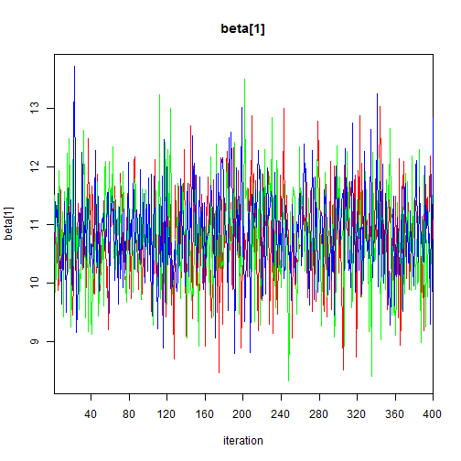 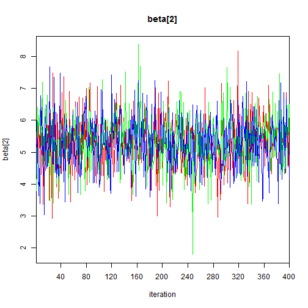 

Check density plots

```r
par(mfrow = c(1,2))
hist(out$sims.list$beta[,1])
abline(v = 0, col = "red")

hist(out$sims.list$beta[,2])
abline(v = 0, col = "red")
```

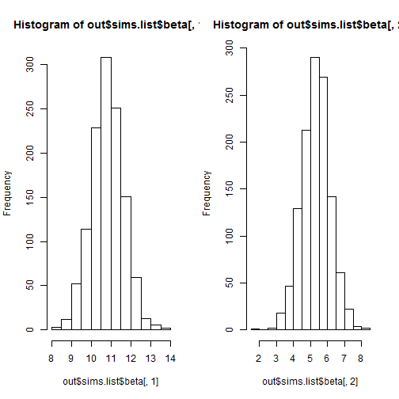 

```r
dev.off()
```

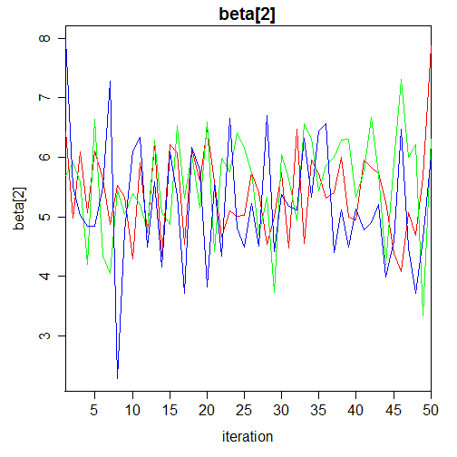 

```
## RStudioGD 
##         2
```

Beta coefs and credible intervals

```r
my.coefs = out$summary[c("beta[1]", "beta[2]"),c(1:3,7)]
my.coefs
```

```
##           mean     sd  2.5%  97.5%
## beta[1] 10.818 0.8015 9.219 12.345
## beta[2]  5.315 0.8261 3.670  6.943
```

Compare with results using lm above

```r
mod = lm(rich ~ scale(logprod), data = div) # this time with standardized predictors
summary(mod)
```

```
## 
## Call:
## lm(formula = rich ~ scale(logprod), data = div)
## 
## Residuals:
##    Min     1Q Median     3Q    Max 
## -5.454 -1.704  0.579  1.282  7.763 
## 
## Coefficients:
##                Estimate Std. Error t value Pr(>|t|)    
## (Intercept)      10.833      0.733   14.77  9.6e-11 ***
## scale(logprod)    5.323      0.755    7.05  2.7e-06 ***
## ---
## Signif. codes:  0 '***' 0.001 '**' 0.01 '*' 0.05 '.' 0.1 ' ' 1
## 
## Residual standard error: 3.11 on 16 degrees of freedom
## Multiple R-squared:  0.757,	Adjusted R-squared:  0.742 
## F-statistic: 49.8 on 1 and 16 DF,  p-value: 2.72e-06
```

```r
cbind(coef(mod), my.coefs[,1])
```

```
##                  [,1]   [,2]
## (Intercept)    10.833 10.818
## scale(logprod)  5.323  5.315
```

```r
# coef plots
mod.beta.freq = coef(mod)
mod.se.freq = sqrt(diag(vcov(mod)))
mod.beta.jags = my.coefs[,1]
mod.se.jags = my.coefs[,2]

par(mfrow = c(1,1))
coefplot2(mod.beta.freq, mod.se.freq, col = "red", varnames = names(mod.beta.freq), xlim = c(-10,14))
coefplot2(mod.beta.jags, mod.se.jags, col = "blue", varnames = names(mod.beta.freq), add = TRUE, offset = -0.1)
```

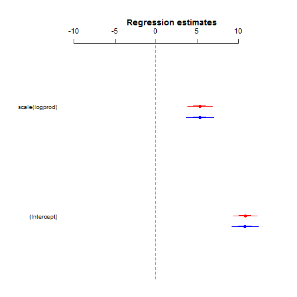 

Don't forget model checks, e.g. residual plots:

```r
plot(out$mean$mu, out$mean$Res)
```

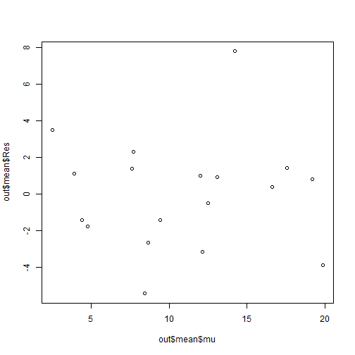 

Now with elevation treated as a random effect (intercept only)...


```r
# Bundle data for JAGS
# Random effects:
Nre = length(unique(div$elev))
jags.data <- list(Y = div$rich,
                 X = X,
                 N = nrow(div),
                 K = ncol(X),
                 Elev = div$elev,
                 Nre = Nre)
```


Specify model - only need to modify a few lines of code to include the random effect.

```r
###################################################
# JAGS code
{sink("mixedmodel.txt")
cat("
    model{
    # Priors beta and sigma
    for (i in 1:K) {beta[i] ~ dnorm(0, 0.0001)}
    tau  <- 1 / (sigma * sigma)
    sigma ~ dunif(0.0001, 20)
    
    # Priors random effects and sigma_Elev
    for (i in 1:Nre) {a[i] ~ dnorm(0, tau_Elev)}
    tau_Elev <- 1 / (sigma_Elev * sigma_Elev)
    sigma_Elev ~ dunif(0.0001, 20)
    
    # Likelihood
    for (i in 1:N) {
    Y[i]    ~ dnorm(mu[i], tau)
    mu[i]  <- eta[i] + a[Elev[i]] # random intercept
    eta[i] <- inprod(beta[], X[i,])
    
    # Residuals
    Res[i]    <- Y[i] - mu[i]
    }
    }
    ",fill = TRUE)
sink()}
##############################################
```

Initial values, parameters to save etc.


```r
# # Initial values
# inits = function () {
#   list(
#     beta = rnorm(ncol(X), 0, 0.01),
#     sigma = runif(1, 0.0001, 20),
#     a = rnorm(Nre, 0, 0.01),
#     sigma_Elev = runif(1, 0.0001, 20))}

# Parameters to save
params = c("beta", "sigma", "Res", "a", "sigma_Elev", "mu", "eta")
```

Run JAGS, run...

```r
fit.mixmod = jags(data = jags.data,
           # inits = inits,
           parameters = params,
           model = "mixedmodel.txt",
           n.chains = 3,
           n.thin = 10,
           n.iter = 5000,
           n.burnin = 1000)
```

Check output


```r
out = fit.mixmod$BUGSoutput
print(out, digits = 3)
```

```
## Inference for Bugs model at "mixedmodel.txt", fit using jags,
##  3 chains, each with 5000 iterations (first 1000 discarded), n.thin = 10
##  n.sims = 1200 iterations saved
##              mean    sd    2.5%    25%    50%    75%  97.5%  Rhat n.eff
## Res[1]     -2.905 2.041  -6.425 -4.467 -2.998 -1.439  0.864 1.006   310
## Res[2]      1.563 1.423  -1.224  0.661  1.564  2.470  4.399 1.002   830
## Res[3]     -1.613 1.381  -4.374 -2.452 -1.582 -0.762  0.945 1.001  1200
## Res[4]      0.607 1.430  -2.160 -0.297  0.594  1.518  3.466 1.002   820
## Res[5]     -2.546 1.403  -5.308 -3.429 -2.634 -1.672  0.224 1.002  1100
## Res[6]     -0.407 1.594  -3.544 -1.455 -0.428  0.721  2.812 1.004   480
## Res[7]      2.048 1.985  -1.767  0.765  2.014  3.406  5.802 1.001  1200
## Res[8]     -0.158 1.604  -3.275 -1.222 -0.197  0.934  3.148 1.004   550
## Res[9]     -1.448 1.859  -4.938 -2.770 -1.485 -0.099  2.009 1.001  1200
## Res[10]    -2.163 1.745  -5.430 -3.356 -2.260 -1.171  1.405 1.001  1200
## Res[11]     0.089 1.687  -3.062 -1.021  0.068  1.203  3.333 1.000  1200
## Res[12]     5.783 1.675   2.683  4.633  5.772  6.930  9.045 1.002  1200
## Res[13]     1.597 1.599  -1.466  0.558  1.604  2.697  4.758 1.001  1200
## Res[14]    -0.849 1.596  -4.199 -1.904 -0.827  0.148  2.237 1.000  1200
## Res[15]     1.689 1.512  -1.126  0.712  1.645  2.679  4.785 1.002   790
## Res[16]    -2.876 1.699  -6.183 -3.993 -2.862 -1.725  0.476 1.000  1200
## Res[17]     1.540 1.395  -1.198  0.661  1.452  2.408  4.283 1.002  1000
## Res[18]     0.217 1.432  -2.606 -0.692  0.140  1.066  3.065 1.001  1200
## a[1]       -0.091 2.400  -4.278 -1.276 -0.114  0.850  5.241 1.008  1200
## a[2]       -0.168 2.471  -5.482 -1.091  0.000  0.950  4.324 1.019   970
## a[3]        3.165 3.230  -1.197  0.796  2.664  4.947 10.988 1.004  1200
## a[4]        1.958 3.706  -3.288 -0.208  0.876  3.670 11.581 1.003   600
## a[5]       -1.101 2.879  -7.695 -2.264 -0.397  0.564  3.001 1.006  1200
## a[6]       -3.203 3.236 -10.614 -5.044 -2.577 -0.740  0.850 1.007   510
## beta[1]    10.731 2.194   6.054  9.858 10.799 11.681 14.411 1.014  1200
## beta[2]     3.630 1.940  -0.363  2.318  3.947  5.073  6.676 1.002   970
## deviance   86.681 6.180  75.469 82.050 87.059 90.967 98.519 1.003   600
## eta[1]      9.108 2.315   4.995  7.909  8.933 10.068 13.702 1.015  1200
## eta[2]      8.604 2.415   4.706  7.275  8.339  9.621 13.519 1.014  1200
## eta[3]      9.781 2.225   5.586  8.773  9.727 10.668 13.943 1.016  1200
## eta[4]      8.561 2.425   4.669  7.214  8.286  9.574 13.508 1.014  1200
## eta[5]     11.637 2.273   6.359 10.847 11.822 12.765 14.963 1.011  1200
## eta[6]      6.610 3.022   2.125  4.701  6.099  8.052 13.368 1.009  1200
## eta[7]      5.053 3.646  -0.390  2.625  4.336  7.064 13.322 1.007  1200
## eta[8]      6.361 3.115   1.761  4.357  5.819  7.931 13.350 1.009  1200
## eta[9]     12.283 2.388   6.572 11.412 12.569 13.580 15.725 1.009  1200
## eta[10]     9.264 2.289   5.172  8.093  9.110 10.195 13.758 1.015  1200
## eta[11]     6.012 3.251   1.204  3.920  5.447  7.681 13.331 1.008  1200
## eta[12]    13.052 2.579   6.853 12.016 13.460 14.529 16.896 1.006  1200
## eta[13]    16.445 3.857   7.437 14.421 17.066 19.086 22.182 1.002  1100
## eta[14]    14.684 3.128   7.257 13.247 15.228 16.686 19.135 1.003  1200
## eta[15]    15.353 3.393   7.447 13.719 15.930 17.617 20.207 1.003  1100
## eta[16]    16.918 4.068   7.429 14.704 17.605 19.726 22.990 1.002  1000
## eta[17]    11.550 2.261   6.324 10.761 11.715 12.669 14.876 1.011  1200
## eta[18]    11.874 2.310   6.369 11.061 12.093 13.051 15.191 1.010  1200
## mu[1]       5.905 2.041   2.136  4.439  5.998  7.467  9.425 1.006   310
## mu[2]       8.437 1.423   5.601  7.530  8.436  9.339 11.224 1.002   790
## mu[3]       9.613 1.381   7.055  8.762  9.582 10.452 12.374 1.001  1200
## mu[4]       8.393 1.430   5.534  7.482  8.406  9.297 11.160 1.002   780
## mu[5]      11.546 1.403   8.776 10.672 11.634 12.429 14.308 1.003  1200
## mu[6]       3.407 1.594   0.188  2.279  3.428  4.455  6.544 1.004   480
## mu[7]       3.952 1.985   0.198  2.594  3.986  5.235  7.767 1.001  1200
## mu[8]       3.158 1.604  -0.148  2.066  3.197  4.222  6.275 1.004   550
## mu[9]      15.448 1.859  11.991 14.099 15.485 16.770 18.938 1.001  1200
## mu[10]      8.163 1.745   4.595  7.171  8.260  9.356 11.430 1.000  1200
## mu[11]      4.911 1.687   1.667  3.797  4.932  6.021  8.062 1.000  1200
## mu[12]     16.217 1.675  12.955 15.070 16.228 17.367 19.317 1.000  1200
## mu[13]     18.403 1.599  15.242 17.303 18.396 19.442 21.466 1.001  1200
## mu[14]     17.849 1.596  14.763 16.852 17.827 18.904 21.199 1.000  1200
## mu[15]     17.311 1.512  14.215 16.321 17.355 18.288 20.126 1.002   740
## mu[16]     18.876 1.699  15.524 17.725 18.862 19.993 22.183 1.000  1200
## mu[17]     11.460 1.395   8.717 10.592 11.548 12.339 14.198 1.003  1100
## mu[18]     11.783 1.432   8.935 10.934 11.860 12.692 14.606 1.003  1200
## sigma       2.820 0.694   1.725  2.323  2.720  3.230  4.489 1.003   660
## sigma_Elev  3.684 3.063   0.173  1.588  2.870  4.920 12.174 1.004   450
## 
## For each parameter, n.eff is a crude measure of effective sample size,
## and Rhat is the potential scale reduction factor (at convergence, Rhat=1).
## 
## DIC info (using the rule, pD = var(deviance)/2)
## pD = 19.1 and DIC = 105.7
## DIC is an estimate of expected predictive error (lower deviance is better).
```

```r
# Assess mixing/convergence
traceplot(fit.mixmod, varname = c("beta","sigma","sigma_Elev"))
```

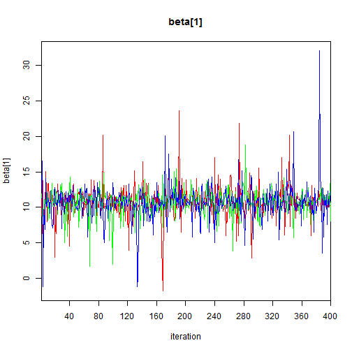 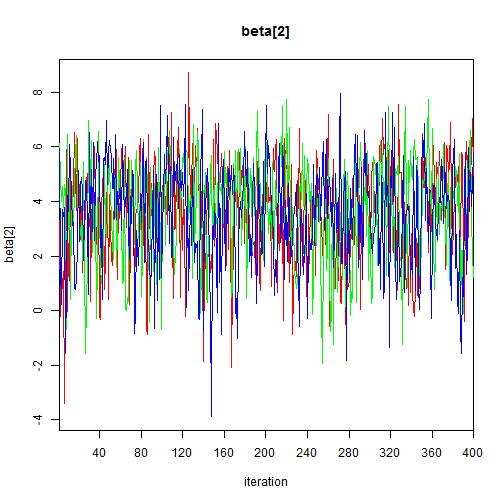 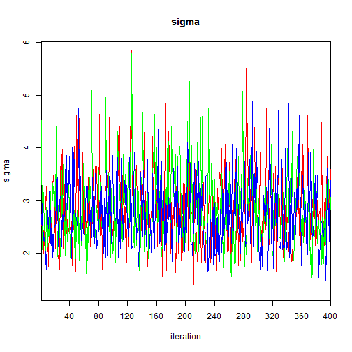 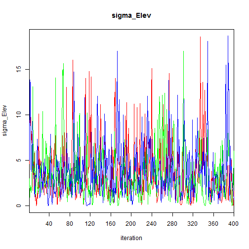 

```r
# Check histograms
par(mfrow = c(1,2))
hist(out$sims.list$beta[,1])
abline(v = 0, col = "red")

hist(out$sims.list$beta[,2])
abline(v = 0, col = "red")
```

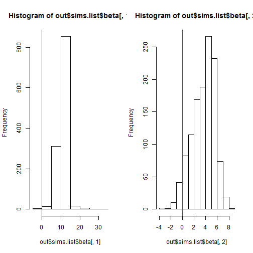 

```r
dev.off()
```

 

```
## RStudioGD 
##         2
```

There are many ways to extract different the same informationg for the output object. Before we just grabbed summary data, but we can also grab the MCMC iterations and perform our own sumamry analyses.


```r
# extract mcmc samples
all.mcmc = mcmc(out$sims.matrix) # combine chains together
dim(all.mcmc)
```

```
## [1] 1200   65
```

```r
colnames(all.mcmc)
```

```
##  [1] "Res[1]"     "Res[2]"     "Res[3]"     "Res[4]"     "Res[5]"    
##  [6] "Res[6]"     "Res[7]"     "Res[8]"     "Res[9]"     "Res[10]"   
## [11] "Res[11]"    "Res[12]"    "Res[13]"    "Res[14]"    "Res[15]"   
## [16] "Res[16]"    "Res[17]"    "Res[18]"    "a[1]"       "a[2]"      
## [21] "a[3]"       "a[4]"       "a[5]"       "a[6]"       "beta[1]"   
## [26] "beta[2]"    "deviance"   "eta[1]"     "eta[2]"     "eta[3]"    
## [31] "eta[4]"     "eta[5]"     "eta[6]"     "eta[7]"     "eta[8]"    
## [36] "eta[9]"     "eta[10]"    "eta[11]"    "eta[12]"    "eta[13]"   
## [41] "eta[14]"    "eta[15]"    "eta[16]"    "eta[17]"    "eta[18]"   
## [46] "mu[1]"      "mu[2]"      "mu[3]"      "mu[4]"      "mu[5]"     
## [51] "mu[6]"      "mu[7]"      "mu[8]"      "mu[9]"      "mu[10]"    
## [56] "mu[11]"     "mu[12]"     "mu[13]"     "mu[14]"     "mu[15]"    
## [61] "mu[16]"     "mu[17]"     "mu[18]"     "sigma"      "sigma_Elev"
```

```r
# all.a = all.mcmc[,grep("a",colnames(all.mcmc))] # alternatively out$sims.list$a
all.beta = all.mcmc[,grep("beta",colnames(all.mcmc))] # alternatively out$sims.list$beta
# all.sigma.elev = all.mcmc[,grep("sigma_Elev",colnames(all.mcmc))] # alternatively out$sims.list$sigma_Elev
```

Compare with lmer...

```r
mixmod = lmer(rich ~ scale(logprod) + (1|elev), data = div, REML = TRUE) # standardized predictors
summary(mixmod)
```

```
## Linear mixed model fit by REML ['lmerMod']
## Formula: rich ~ scale(logprod) + (1 | elev)
##    Data: div
## 
## REML criterion at convergence: 86.7
## 
## Scaled residuals: 
##     Min      1Q  Median      3Q     Max 
## -1.3761 -0.5986 -0.0094  0.5593  2.2647 
## 
## Random effects:
##  Groups   Name        Variance Std.Dev.
##  elev     (Intercept) 3.32     1.82    
##  Residual             7.42     2.72    
## Number of obs: 18, groups: elev, 6
## 
## Fixed effects:
##                Estimate Std. Error t value
## (Intercept)      10.833      0.983   11.02
## scale(logprod)    4.752      0.956    4.97
## 
## Correlation of Fixed Effects:
##             (Intr)
## scal(lgprd) 0.000
```

```r
apply(all.beta,2,mean) 
```

```
## beta[1] beta[2] 
##   10.73    3.63
```

```r
cbind(fixef(mixmod), apply(all.beta,2,mean))
```

```
##                  [,1]  [,2]
## (Intercept)    10.833 10.73
## scale(logprod)  4.752  3.63
```


```r
# coef plots
mixmod.beta.freq = fixef(mixmod)
mixmod.se.freq = sqrt(diag(vcov(mixmod)))
mixmod.beta.jags = apply(all.beta,2,mean)
mixmod.se.jags = apply(all.beta,2, sd)

coefplot2(mixmod.beta.freq, mixmod.se.freq, col = "red", varnames = names(mod.beta.freq), xlim = c(-10,14))
coefplot2(mixmod.beta.jags, mixmod.se.jags, col = "blue", varnames = names(mod.beta.freq), add = TRUE, offset = -0.1)
```

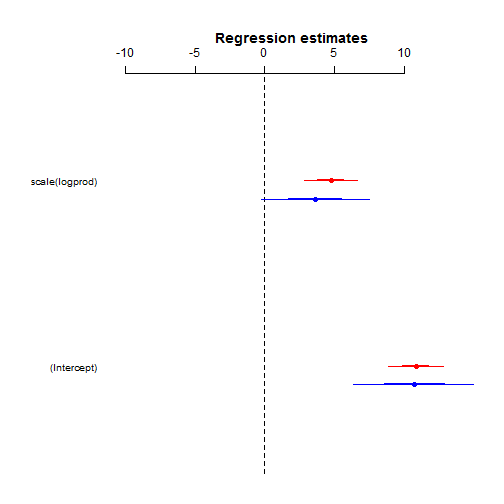 

Maybe should have used a different distribution given the response is counts of species richness (e.g. Possion or negative binomial)?


```r
mixmod.pois = glmer(rich ~ scale(logprod) + (1|elev), data = div, family = "poisson")
summary(mixmod.pois) 
```

```
## Generalized linear mixed model fit by maximum likelihood (Laplace
##   Approximation) [glmerMod]
##  Family: poisson ( log )
## Formula: rich ~ scale(logprod) + (1 | elev)
##    Data: div
## 
##      AIC      BIC   logLik deviance df.resid 
##     95.5     98.2    -44.8     89.5       15 
## 
## Scaled residuals: 
##    Min     1Q Median     3Q    Max 
## -1.461 -0.629  0.022  0.535  1.935 
## 
## Random effects:
##  Groups Name        Variance Std.Dev.
##  elev   (Intercept) 0.0158   0.126   
## Number of obs: 18, groups: elev, 6
## 
## Fixed effects:
##                Estimate Std. Error z value Pr(>|z|)    
## (Intercept)      2.2557     0.0971   23.22  < 2e-16 ***
## scale(logprod)   0.4921     0.0942    5.22  1.8e-07 ***
## ---
## Signif. codes:  0 '***' 0.001 '**' 0.01 '*' 0.05 '.' 0.1 ' ' 1
## 
## Correlation of Fixed Effects:
##             (Intr)
## scal(lgprd) -0.288
```


```r
#################################################################
# JAGS code
{sink("genmixedmodel.txt")
cat("
    model{
    # Priors beta
    for (i in 1:K) {beta[i] ~ dnorm(0, 0.0001)}
    
    # Priors random effects and sigma_Elev
    for (i in 1:Nre) {a[i] ~ dnorm(0, tau_Elev)}
    tau_Elev <- 1 / (sigma_Elev * sigma_Elev)
    sigma_Elev ~ dunif(0.0001, 20)
    
    # Likelihood
    for (i in 1:N) {
    Y[i]   ~ dpois(mu[i])   
    log(mu[i]) <- eta[i] # in jags you have to specify the link function
    eta[i] <- inprod(beta[], X[i,]) + a[Elev[i]]
    
    # Residuals
    Res[i]    <- Y[i] - mu[i]
    }
    }
    ",fill = TRUE)
sink()}
############################################################

# Initial values & parameters to save
# inits  = function () {
#   list(
#     beta       = rnorm(ncol(X), 0, 0.01),
#     a          = rnorm(Nre, 0, 0.01),
#     sigma_Elev = runif(1, 0.0001, 20))  }

params = c("beta", "Res", "a", "sigma_Elev", "mu", "eta")
```


```r
# Start JAGS
fit.mixpois = jags(data       = jags.data,
           # inits = inits,
           parameters = params,
           model = "genmixedmodel.txt",
           n.thin = 10,
           n.chains = 3,
           n.burnin = 1000,
           n.iter = 5000)
```

In case of lack of convergence - update on  the fly!

```r
fit.mixpois = update(fit.mixpois, n.iter = 10000, n.thin = 10) # 
```

Check output...


```r
out = fit.mixpois$BUGSoutput
print(out, digits = 3)
```

```
## Inference for Bugs model at "genmixedmodel.txt", fit using jags,
##  3 chains, each with 10000 iterations (first 5000 discarded), n.thin = 10
##  n.sims = 3000 iterations saved
##              mean    sd   2.5%    25%    50%    75%  97.5%  Rhat n.eff
## Res[1]     -2.173 1.618 -5.366 -3.347 -2.079 -0.971  0.638 1.001  3000
## Res[2]      1.759 1.523 -1.655  0.898  1.897  2.855  4.243 1.001  3000
## Res[3]     -1.293 1.612 -4.748 -2.229 -1.134 -0.157  1.385 1.001  3000
## Res[4]      0.795 1.524 -2.620 -0.067  0.935  1.888  3.274 1.001  3000
## Res[5]     -2.063 1.676 -5.699 -3.064 -1.970 -0.935  1.002 1.001  2600
## Res[6]     -0.952 1.131 -3.301 -1.716 -0.883 -0.125  1.027 1.000  3000
## Res[7]      1.229 1.206 -1.603  0.544  1.383  2.055  3.173 1.007   450
## Res[8]     -0.851 1.102 -3.171 -1.590 -0.782 -0.043  1.065 1.000  3000
## Res[9]     -0.804 2.377 -5.925 -2.306 -0.544  0.946  3.067 1.003  1100
## Res[10]    -1.331 1.555 -4.439 -2.320 -1.337 -0.288  1.706 1.001  2700
## Res[11]    -0.235 1.158 -2.830 -0.938 -0.109  0.555  1.714 1.006   510
## Res[12]     6.007 2.283  1.172  4.537  6.179  7.655  9.867 1.002  1700
## Res[13]     1.136 2.541 -3.967 -0.475  1.251  2.866  5.864 1.001  3000
## Res[14]    -1.965 2.867 -8.384 -3.728 -1.730  0.091  2.919 1.001  3000
## Res[15]     2.164 2.204 -2.535  0.762  2.320  3.637  6.211 1.002  3000
## Res[16]    -3.842 2.880 -9.692 -5.698 -3.715 -1.867  1.430 1.001  3000
## Res[17]     2.036 1.665 -1.562  1.051  2.137  3.174  5.084 1.001  2400
## Res[18]     0.662 1.718 -3.019 -0.360  0.727  1.821  3.847 1.001  3000
## a[1]        0.070 0.278 -0.414 -0.069  0.048  0.198  0.683 1.001  3000
## a[2]        0.085 0.295 -0.503 -0.045  0.074  0.233  0.672 1.006   650
## a[3]        0.293 0.321 -0.164  0.086  0.248  0.449  1.067 1.001  3000
## a[4]        0.108 0.389 -0.487 -0.108  0.028  0.267  1.126 1.001  3000
## a[5]       -0.107 0.341 -0.920 -0.253 -0.054  0.078  0.470 1.002  3000
## a[6]       -0.470 0.436 -1.542 -0.691 -0.389 -0.148  0.080 1.004   870
## beta[1]     2.228 0.254  1.692  2.124  2.235  2.343  2.695 1.008  1300
## beta[2]     0.376 0.208 -0.124  0.274  0.411  0.516  0.694 1.002  1000
## deviance   85.587 4.068 78.961 82.521 85.140 88.212 93.984 1.001  3000
## eta[1]      1.590 0.338  0.860  1.379  1.625  1.848  2.124 1.001  3000
## eta[2]      2.092 0.182  1.750  1.966  2.092  2.208  2.456 1.001  3000
## eta[3]      2.214 0.172  1.889  2.099  2.212  2.325  2.545 1.001  2900
## eta[4]      2.088 0.183  1.745  1.962  2.087  2.205  2.453 1.001  3000
## eta[5]      2.392 0.152  2.079  2.296  2.395  2.490  2.688 1.001  2400
## eta[6]      1.331 0.300  0.679  1.139  1.357  1.551  1.841 1.001  3000
## eta[7]      1.532 0.248  1.039  1.372  1.530  1.697  2.029 1.006   500
## eta[8]      1.305 0.300  0.660  1.113  1.330  1.524  1.820 1.001  3000
## eta[9]      2.682 0.158  2.392  2.569  2.677  2.792  2.992 1.002  1200
## eta[10]     1.968 0.222  1.457  1.839  1.993  2.119  2.346 1.001  2600
## eta[11]     1.631 0.220  1.190  1.492  1.631  1.781  2.058 1.005   530
## eta[12]     2.762 0.141  2.496  2.663  2.761  2.860  3.036 1.002  1900
## eta[13]     2.928 0.135  2.649  2.841  2.931  3.019  3.177 1.001  3000
## eta[14]     2.931 0.150  2.645  2.828  2.930  3.031  3.234 1.001  3000
## eta[15]     2.815 0.131  2.549  2.732  2.814  2.903  3.070 1.001  3000
## eta[16]     2.977 0.146  2.679  2.883  2.981  3.077  3.246 1.001  3000
## eta[17]     2.383 0.152  2.069  2.285  2.385  2.481  2.678 1.001  2200
## eta[18]     2.417 0.153  2.098  2.320  2.422  2.514  2.709 1.001  3000
## mu[1]       5.173 1.618  2.362  3.971  5.079  6.347  8.366 1.001  3000
## mu[2]       8.241 1.523  5.757  7.145  8.103  9.102 11.655 1.001  3000
## mu[3]       9.293 1.612  6.615  8.157  9.134 10.229 12.748 1.001  3000
## mu[4]       8.205 1.524  5.726  7.112  8.065  9.067 11.620 1.001  3000
## mu[5]      11.063 1.676  7.998  9.935 10.970 12.064 14.699 1.001  2500
## mu[6]       3.952 1.131  1.973  3.125  3.883  4.716  6.301 1.001  3000
## mu[7]       4.771 1.206  2.827  3.945  4.617  5.456  7.603 1.006   490
## mu[8]       3.851 1.102  1.935  3.043  3.782  4.590  6.171 1.001  3000
## mu[9]      14.804 2.377 10.933 13.054 14.544 16.306 19.925 1.002  1200
## mu[10]      7.331 1.555  4.294  6.288  7.337  8.320 10.439 1.001  2500
## mu[11]      5.235 1.158  3.286  4.445  5.109  5.938  7.830 1.005   530
## mu[12]     15.993 2.283 12.133 14.345 15.821 17.463 20.828 1.002  1800
## mu[13]     18.864 2.541 14.136 17.134 18.749 20.475 23.967 1.001  3000
## mu[14]     18.965 2.867 14.081 16.909 18.730 20.728 25.384 1.001  3000
## mu[15]     16.836 2.204 12.789 15.363 16.680 18.238 21.535 1.001  3000
## mu[16]     19.842 2.880 14.570 17.867 19.715 21.698 25.692 1.001  3000
## mu[17]     10.964 1.665  7.916  9.826 10.863 11.949 14.562 1.001  2200
## mu[18]     11.338 1.718  8.153 10.179 11.273 12.360 15.019 1.001  3000
## sigma_Elev  0.453 0.379  0.038  0.211  0.351  0.569  1.471 1.007   700
## 
## For each parameter, n.eff is a crude measure of effective sample size,
## and Rhat is the potential scale reduction factor (at convergence, Rhat=1).
## 
## DIC info (using the rule, pD = var(deviance)/2)
## pD = 8.3 and DIC = 93.9
## DIC is an estimate of expected predictive error (lower deviance is better).
```

```r
# Check mixing/convergence
traceplot(fit.mixmod, varname = c("beta","sigma_Elev"))
```

   

```r
# Check histograms
hist(out$sims.list$beta[,1])
abline(v = 0, col = "red")
```

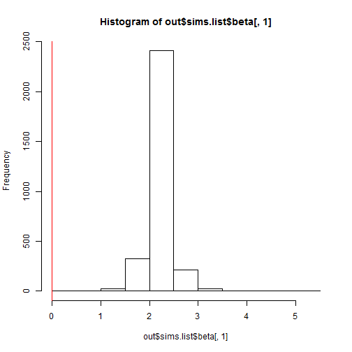 

```r
hist(out$sims.list$beta[,2])
abline(v = 0, col = "red")
```

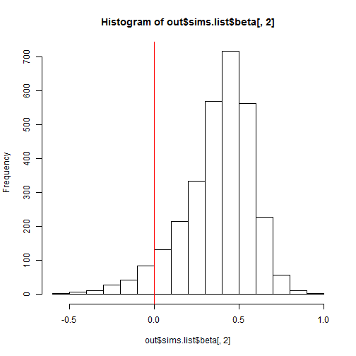 

```r
# Extract mcmc samples
all.mcmc = mcmc(out$sims.matrix)
dim(all.mcmc)
```

```
## [1] 3000   64
```

```r
colnames(all.mcmc)
```

```
##  [1] "Res[1]"     "Res[2]"     "Res[3]"     "Res[4]"     "Res[5]"    
##  [6] "Res[6]"     "Res[7]"     "Res[8]"     "Res[9]"     "Res[10]"   
## [11] "Res[11]"    "Res[12]"    "Res[13]"    "Res[14]"    "Res[15]"   
## [16] "Res[16]"    "Res[17]"    "Res[18]"    "a[1]"       "a[2]"      
## [21] "a[3]"       "a[4]"       "a[5]"       "a[6]"       "beta[1]"   
## [26] "beta[2]"    "deviance"   "eta[1]"     "eta[2]"     "eta[3]"    
## [31] "eta[4]"     "eta[5]"     "eta[6]"     "eta[7]"     "eta[8]"    
## [36] "eta[9]"     "eta[10]"    "eta[11]"    "eta[12]"    "eta[13]"   
## [41] "eta[14]"    "eta[15]"    "eta[16]"    "eta[17]"    "eta[18]"   
## [46] "mu[1]"      "mu[2]"      "mu[3]"      "mu[4]"      "mu[5]"     
## [51] "mu[6]"      "mu[7]"      "mu[8]"      "mu[9]"      "mu[10]"    
## [56] "mu[11]"     "mu[12]"     "mu[13]"     "mu[14]"     "mu[15]"    
## [61] "mu[16]"     "mu[17]"     "mu[18]"     "sigma_Elev"
```

```r
# all.a = all.mcmc[,grep("a",colnames(all.mcmc))]
all.beta = all.mcmc[,grep("beta",colnames(all.mcmc))]
# all.sigma.elev = all.mcmc[,grep("sigma_Elev",colnames(all.mcmc))]
```

Compare with results from lme4 

```r
summary(mixmod.pois)
```

```
## Generalized linear mixed model fit by maximum likelihood (Laplace
##   Approximation) [glmerMod]
##  Family: poisson ( log )
## Formula: rich ~ scale(logprod) + (1 | elev)
##    Data: div
## 
##      AIC      BIC   logLik deviance df.resid 
##     95.5     98.2    -44.8     89.5       15 
## 
## Scaled residuals: 
##    Min     1Q Median     3Q    Max 
## -1.461 -0.629  0.022  0.535  1.935 
## 
## Random effects:
##  Groups Name        Variance Std.Dev.
##  elev   (Intercept) 0.0158   0.126   
## Number of obs: 18, groups: elev, 6
## 
## Fixed effects:
##                Estimate Std. Error z value Pr(>|z|)    
## (Intercept)      2.2557     0.0971   23.22  < 2e-16 ***
## scale(logprod)   0.4921     0.0942    5.22  1.8e-07 ***
## ---
## Signif. codes:  0 '***' 0.001 '**' 0.01 '*' 0.05 '.' 0.1 ' ' 1
## 
## Correlation of Fixed Effects:
##             (Intr)
## scal(lgprd) -0.288
```

```r
cbind(fixef(mixmod.pois), apply(all.beta,2,mean))
```

```
##                  [,1]   [,2]
## (Intercept)    2.2557 2.2280
## scale(logprod) 0.4921 0.3764
```

```r
# coef plots
mixmod.pois.beta.freq = exp(fixef(mixmod.pois))
mixmod.pois.se.freq = exp(sqrt(diag(vcov(mixmod.pois))))
mixmod.pois.beta.jags = exp(apply(all.beta,2,mean))
mixmod.pois.se.jags = exp(apply(all.beta,2, sd))

coefplot2(mixmod.pois.beta.freq, mixmod.pois.se.freq, col = "red", 
          varnames = names(mod.beta.freq), xlim = c(-10,14))
coefplot2(mixmod.pois.beta.jags, mixmod.pois.se.jags, col = "blue", 
          varnames = names(mod.beta.freq), add = TRUE, offset = -0.1)
```

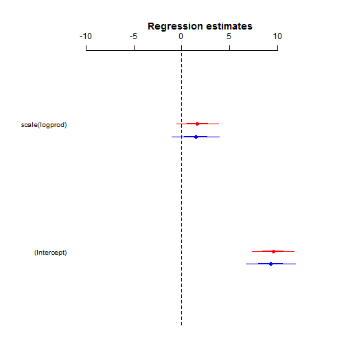 

Finally for a coefficient plot of all three models together...

```r
coefplot2(mod.beta.freq, mod.se.freq, col = "darkred", 
          varnames = names(mod.beta.freq), xlim = c(-10,14))
coefplot2(mod.beta.jags, mod.se.jags, col = "red", 
          varnames = names(mod.beta.freq), add = TRUE, offset = -0.05)


coefplot2(mixmod.beta.freq, mixmod.se.freq, col = "darkgreen", 
          varnames = names(mod.beta.freq), add = TRUE, offset = -0.15)
coefplot2(mixmod.beta.jags, mixmod.se.jags, col = "lightgreen", 
          varnames = names(mod.beta.freq), add = TRUE, offset = -0.2)


coefplot2(mixmod.pois.beta.freq, mixmod.pois.se.freq, col = "darkblue", 
          varnames = names(mod.beta.freq), add = TRUE, offset = -0.3)
coefplot2(mixmod.pois.beta.jags, mixmod.pois.se.jags, col = "blue", 
          varnames = names(mod.beta.freq), add = TRUE, offset = -0.35)
```

 

---------------------------------------------------------

For more on fitting models in a Bayesian framework in R, I highly recommend '[A Beginner's Guide to GLM and GLMM with R](http://www.highstat.com/BGGLM.htm)' by Zuur et al. and '[Introduction to WinBUGS for Ecologists](http://www.mbr-pwrc.usgs.gov/software/kerybook/)' by Kery. The Zuur et al. book uses R2jags and comprises lots of useful examples based on real ecological datasets. The Kery book provides an excellent walk through from the basics through to more complex models (based on R2WinBUGS, but the code can easily be adapted to R2jags/JAGS). 


