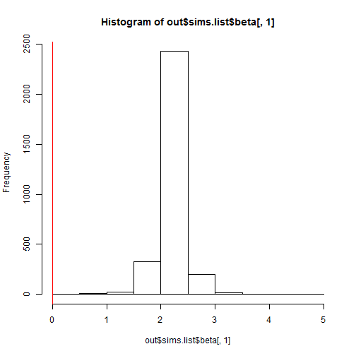

The purpose of this [ecostats](http://www.eco-stats.unsw.edu.au/) lab is to provide a very basic primer on running basic lm, glm and glmms in a Bayesian framework using the R2jags package (and of course JAGS). As such, the goal is not to debate the relative merits of Bayesian vs frequentist approaches, but hopefully to demystify the fitting of Bayesian models, and more specifically demonstrate that in a wide variety of (more basic) use cases the parameter estimates obtained from the two approaches are typically very similar.

We will be attempting to reproduce a small element of the analysis from a recently published article in *Journal of Ecology* (for which all the data is available at datadryad.org).

Kessler, M., Salazar, L., Homeier, J., Kluge, J. (2014), Species richness-productivity relationships of tropical terrestrial ferns at regional and local scales. *Journal of Ecology*, 102: 1623-1633. <http://onlinelibrary.wiley.com/doi/10.1111/1365-2745.12299/abstract>

First things first: JAGS, R packages and data.  

If you don't have it already you will need to dowload JAGS from http://sourceforge.net/projects/mcmc-jags/files/rjags/. 


```r
# required packages
#
# install.packages("lme4")
# install.packages("R2jags")
# install.apckages("runjags")
# install.packages("coefplot2", repos="http://www.math.mcmaster.ca/bolker/R", type = "source")

library(lme4)
library(R2jags)
library(runjags)
library(coefplot2)
```

To obtain the data you can either uncomment the following code block, or alternatively proceed directly to the  next block and read in a reformatted file prepared a little earlier... 


```r
# temp <- tempfile(fileext=".csv")
# download.file(
#   "http://datadryad.org//bitstream/handle/10255/dryad.67401/Kessler Data Table.csv", temp)
# fern.dat <- read.csv(temp, header = TRUE, stringsAsFactors=FALSE)
# rm(temp)
# 
# fern.dat = fern.dat[-1,]
# names(fern.dat) = c("plot", "elev", "tag", "species", 
#                     "N.09", "av.09", "new.10", "N.10", 
#                     "av.10", "new.11", "N.11", "av.11", 
#                     "l.09", "l.10", "l.11", "prod.0910", 
#                     "prod.1011", "rhz.09", "rhz.10", "rhz.11", 
#                     "rhz.w", "rhz.09g", "rhz.10g", "rhz.11g", 
#                     "rhz.prod.0910", "rhz.prod.1011", "arb.09", "arb.10", 
#                     "arb.11", "av.diam", "t.rhz.09", "t.rhz.10",
#                     "t.rhz.11", "t.rhz.prod.0910", "t.rhz.prod.1011")
# 
# fern.dat[,c(16,17,25,26)][is.na(fern.dat[,c(16,17,25,26)])] = 0 # convert productivty NAs to zero
# # length(unique(fern.dat$species)) # 88, but article says 91...
# 
# library(dplyr)
# div = fern.dat %>% 
#   mutate(prod = (as.numeric(prod.1011) + as.numeric(rhz.prod.1011))) %>% 
#   filter(elev != 1500, elev != 3000) %>% # plots at 1500 and 3000 m appear not included?? (fig 1) 
#   group_by(plot, elev) %>% 
#   summarise(length(unique(species)), log(sum(prod)))
# 
# colnames(div)[2:4] = c("elev", "rich", "logprod")
```


```r
div = read.csv(file = "KessDiv.csv", header = TRUE)

div$elev = as.numeric(as.factor(div$elev))
div$plot = as.numeric(as.factor(div$plot))

div
```

```
##    plot elev rich logprod
## 1     1    6    3   5.486
## 2    10    2   10   5.310
## 3    11    2    8   5.721
## 4    12    2    9   5.295
## 5    13    1    9   6.369
## 6    14    6    3   4.614
## 7    15    5    6   4.070
## 8    16    6    3   4.527
## 9     2    3   14   6.594
## 10   17    5    6   5.540
## 11   18    5    5   4.405
## 12    3    3   22   6.863
## 13    4    4   20   8.048
## 14    5    3   17   7.433
## 15    6    4   19   7.667
## 16    7    4   16   8.213
## 17    8    1   13   6.339
## 18    9    1   12   6.452
```

**Hypothesis: There is a significant relationship between fern species richness `div$rich` and fern productivity `div$logprod`.**

*Frequentist approach*


```r
# lm 
mod = lm(rich ~ logprod, data = div)
summary(mod) # -ve intercept = negative species richness at zero productivity!
```

```
## 
## Call:
## lm(formula = rich ~ logprod, data = div)
## 
## Residuals:
##    Min     1Q Median     3Q    Max 
## -5.454 -1.704  0.579  1.282  7.763 
## 
## Coefficients:
##             Estimate Std. Error t value Pr(>|t|)    
## (Intercept)  -14.584      3.677   -3.97   0.0011 ** 
## logprod        4.199      0.595    7.05  2.7e-06 ***
## ---
## Signif. codes:  0 '***' 0.001 '**' 0.01 '*' 0.05 '.' 0.1 ' ' 1
## 
## Residual standard error: 3.11 on 16 degrees of freedom
## Multiple R-squared:  0.757,	Adjusted R-squared:  0.742 
## F-statistic: 49.8 on 1 and 16 DF,  p-value: 2.72e-06
```

```r
plot(rich ~ logprod, data=div)
abline(mod)
```

 

With a random effect on elevation (NB: only 6 levels with 3 data points in each)


```r
# lmm
mixmod = lmer(rich ~ logprod + (1|as.factor(div$elev)), data = div) # as.factor not necessary but doing it here for 'cleanliness' 
summary(mixmod) # parameter estimates same sign as original paper but different abs value (poss due to how the productivty measure was calculated)
```

```
## Linear mixed model fit by REML ['lmerMod']
## Formula: rich ~ logprod + (1 | as.factor(div$elev))
##    Data: div
## 
## REML criterion at convergence: 87.2
## 
## Scaled residuals: 
##     Min      1Q  Median      3Q     Max 
## -1.3761 -0.5986 -0.0094  0.5593  2.2647 
## 
## Random effects:
##  Groups              Name        Variance Std.Dev.
##  as.factor(div$elev) (Intercept) 3.32     1.82    
##  Residual                        7.42     2.72    
## Number of obs: 18, groups: as.factor(div$elev), 6
## 
## Fixed effects:
##             Estimate Std. Error t value
## (Intercept)  -11.857      4.671   -2.54
## logprod        3.749      0.755    4.97
## 
## Correlation of Fixed Effects:
##         (Intr)
## logprod -0.978
```

*JAGS (Bayesian) approach (linear model)*

First need to bundle data into a JAGS friendly format

```r
X = model.matrix(~ scale(logprod), data = div) #standardize (scale and centre) predictors for JAGS/BUGS analysis

jags.data = list(Y = div$rich, X = X,N = nrow(div), K = ncol(X))
```

Write model in JAGS code (Note the first open and last closing braces are only needed when compiling with knitr, see <https://groups.google.com/forum/#!topic/knitr/TCz9vNLlslY>)


```r
# JAGS Code
#######################################
{sink("model.txt")
cat("
model{

    #Priors beta 
    #In JAGS: dnorm(0, 1/sigma^2)
    for (i in 1:K) {beta[i] ~ dnorm(0, 0.0001)} # small precision = large variance
     
    #Priors sigma
    tau <- 1 / (sigma * sigma)  #tau = 1/ sigma^2
    sigma ~ dunif(0.0001, 10)

    #Likelihood
    for (i in 1:N) {
      Y[i]   ~ dnorm(mu[i], tau)   
      mu[i]  <- eta[i]
      eta[i] <- beta[1] * X[i,1] + beta[2] * X[i,2] 
  
     #Residuals
     Res[i]    <- Y[i] - mu[i]
    }
}
",fill = TRUE)
sink()}
##########################################
```

Provide a function to generate inits for each parameters (can skip this for now as JAGS defaults to random starting values)

```r
# # Initial values
# inits  = function (){
#   list(beta = rnorm(K, 0, 0.01), 
#        sigma = runif(1, 0.0001, 10))
#   }
```

Tell JAGS which parameters you want to save

```r
params = c("beta", "sigma", "Res", "mu")
```

Finally, call JAGS using the `jags` function in R2Jags

```r
fitmod = jags(data = jags.data,
              # inits = inits, 
              parameters = params,
              model = "model.txt",
              n.thin = 10,
              n.chains = 3,
              n.burnin = 1000,
              n.iter = 5000)
```

Extract output...

```r
out = fitmod$BUGSoutput
```

Check mixing/convergence of betas (intercept and slope)...

```r
traceplot(fitmod, varname = c("beta"))
```

  

Check density plots

```r
hist(out$sims.list$beta[,1])
abline(v = 0, col = "red")
```

 

```r
hist(out$sims.list$beta[,2])
abline(v = 0, col = "red")
```

 

Beta coefs and credible intervals

```r
my.coefs = out$summary[c("beta[1]", "beta[2]"),c(1:3,7)]
my.coefs
```

```
##           mean     sd  2.5%  97.5%
## beta[1] 10.821 0.7835 9.125 12.370
## beta[2]  5.369 0.8453 3.631  7.019
```

Compare with results using lm above

```r
mod = lm(rich ~ scale(logprod), data = div) # this time with standardized predictors
summary(mod)
```

```
## 
## Call:
## lm(formula = rich ~ scale(logprod), data = div)
## 
## Residuals:
##    Min     1Q Median     3Q    Max 
## -5.454 -1.704  0.579  1.282  7.763 
## 
## Coefficients:
##                Estimate Std. Error t value Pr(>|t|)    
## (Intercept)      10.833      0.733   14.77  9.6e-11 ***
## scale(logprod)    5.323      0.755    7.05  2.7e-06 ***
## ---
## Signif. codes:  0 '***' 0.001 '**' 0.01 '*' 0.05 '.' 0.1 ' ' 1
## 
## Residual standard error: 3.11 on 16 degrees of freedom
## Multiple R-squared:  0.757,	Adjusted R-squared:  0.742 
## F-statistic: 49.8 on 1 and 16 DF,  p-value: 2.72e-06
```

```r
print(my.coefs, digits =5)
```

```
##            mean      sd   2.5%   97.5%
## beta[1] 10.8207 0.78345 9.1252 12.3705
## beta[2]  5.3693 0.84532 3.6310  7.0192
```

```r
cbind(coef(mod), my.coefs[,1])
```

```
##                  [,1]   [,2]
## (Intercept)    10.833 10.821
## scale(logprod)  5.323  5.369
```

```r
# coef plots
mod.beta.freq = coef(mod)
mod.se.freq = sqrt(diag(vcov(mod)))
mod.beta.jags = my.coefs[,1]
mod.se.jags = my.coefs[,2]

par(mfrow = c(1,1))
coefplot2(mod.beta.freq, mod.se.freq, col = "red", varnames = names(mod.beta.freq), xlim = c(-10,14))
coefplot2(mod.beta.jags, mod.se.jags, col = "blue", varnames = names(mod.beta.freq), add = TRUE, offset = -0.1)
```

 

Don't forget model checks, e.g. residual plots:

```r
plot(out$mean$mu, out$mean$Res)
```

 

Now with elevation treated as a random effect


```r
# Bundle data for JAGS
# Random effects:
Nre = length(unique(div$elev))
jags.data <- list(Y = div$rich,
                 X = X,
                 N = nrow(div),
                 K = ncol(X),
                 Elev = div$elev,
                 Nre = Nre)
```


```r
###################################################
# JAGS code
{sink("mixedmodel.txt")
cat("
    model{
    # Priors beta and sigma
    for (i in 1:K) { beta[i] ~ dnorm(0, 0.0001)}
    tau  <- 1 / (sigma * sigma)
    sigma ~ dunif(0.0001, 20)
    
    # Priors random effects and sigma_Elev
    for (i in 1:Nre) {a[i] ~ dnorm(0, tau_Elev)}
    tau_Elev <- 1 / (sigma_Elev * sigma_Elev)
    sigma_Elev ~ dunif(0.0001, 20)
    
    # Likelihood
    for (i in 1:N) {
    Y[i]    ~ dnorm(mu[i], tau)
    mu[i]  <- eta[i] + a[Elev[i]]
    eta[i] <- inprod(beta[], X[i,])
    
    # Residuals
    Res[i]    <- Y[i] - mu[i]
    }
    }
    ",fill = TRUE)
sink()}
##############################################
```

Initial values, parameters to save etc.


```r
# # Initial values
# inits = function () {
#   list(
#     beta = rnorm(ncol(X), 0, 0.01),
#     sigma = runif(1, 0.0001, 20),
#     a = rnorm(Nre, 0, 0.01),
#     sigma_Elev = runif(1, 0.0001, 20))  }

# Parameters to save
params = c("beta", "sigma", "Res", "a", "sigma_Elev", "mu", "eta")
```

Run JAGS, run...

```r
fit.mixmod = jags(data = jags.data,
           # inits = inits,
           parameters = params,
           model = "mixedmodel.txt",
           n.thin = 10,
           n.chains = 3,
           n.burnin = 1000,
           n.iter = 5000)
```

Check output


```r
out = fit.mixmod$BUGSoutput
print(out, digits = 3)
```

```
## Inference for Bugs model at "mixedmodel.txt", fit using jags,
##  3 chains, each with 5000 iterations (first 1000 discarded), n.thin = 10
##  n.sims = 1200 iterations saved
##              mean    sd    2.5%    25%    50%    75%  97.5%  Rhat n.eff
## Res[1]     -2.917 2.070  -6.586 -4.509 -2.985 -1.451  1.080 1.010   200
## Res[2]      1.513 1.454  -1.424  0.536  1.565  2.497  4.387 1.001  1200
## Res[3]     -1.675 1.398  -4.620 -2.600 -1.673 -0.793  1.024 1.001  1200
## Res[4]      0.556 1.461  -2.413 -0.428  0.608  1.538  3.447 1.001  1200
## Res[5]     -2.581 1.384  -5.220 -3.480 -2.533 -1.740  0.153 1.003   730
## Res[6]     -0.397 1.641  -3.686 -1.427 -0.381  0.615  2.950 1.010   210
## Res[7]      2.079 1.904  -1.479  0.812  2.033  3.429  5.935 1.000  1200
## Res[8]     -0.146 1.653  -3.433 -1.202 -0.158  0.907  3.249 1.009   230
## Res[9]     -1.462 1.906  -5.201 -2.804 -1.467 -0.026  2.102 1.001  1200
## Res[10]    -2.168 1.826  -5.430 -3.329 -2.318 -1.133  1.868 1.003  1200
## Res[11]     0.112 1.630  -3.035 -0.969  0.112  1.159  3.469 1.000  1200
## Res[12]     5.762 1.726   2.445  4.543  5.731  6.941  9.193 1.001  1200
## Res[13]     1.559 1.605  -1.647  0.446  1.562  2.608  4.796 1.001  1200
## Res[14]    -0.884 1.650  -4.233 -1.952 -0.873  0.210  2.377 1.000  1200
## Res[15]     1.660 1.526  -1.225  0.611  1.639  2.704  4.747 1.001  1200
## Res[16]    -2.919 1.702  -6.344 -4.066 -2.869 -1.781  0.396 1.001  1200
## Res[17]     1.506 1.381  -1.099  0.616  1.559  2.339  4.254 1.003   740
## Res[18]     0.180 1.402  -2.495 -0.725  0.223  1.080  2.992 1.003   700
## a[1]       -0.112 2.275  -4.505 -1.213 -0.146  0.998  4.309 1.001  1200
## a[2]       -0.146 2.364  -5.344 -1.242  0.006  1.070  4.350 1.006   470
## a[3]        3.118 3.015  -1.016  0.811  2.622  4.838 10.217 1.000  1200
## a[4]        1.898 3.472  -2.995 -0.278  0.955  3.692 10.411 1.000  1200
## a[5]       -1.130 2.983  -8.538 -2.468 -0.545  0.551  3.925 1.003   550
## a[6]       -3.225 3.206 -10.648 -5.093 -2.596 -0.747  1.034 1.009   230
## beta[1]    10.779 2.039   6.701  9.861 10.757 11.737 14.875 1.002  1000
## beta[2]     3.662 1.952  -0.847  2.462  4.061  5.080  6.663 1.001  1200
## deviance   86.734 6.263  75.283 82.266 86.561 90.946 98.942 1.005   350
## eta[1]      9.141 2.208   5.426  7.890  8.924 10.143 14.206 1.002   750
## eta[2]      8.634 2.325   4.821  7.290  8.306  9.772 13.948 1.003   730
## eta[3]      9.821 2.096   6.058  8.758  9.678 10.819 14.365 1.002   810
## eta[4]      8.590 2.336   4.765  7.229  8.253  9.736 13.926 1.003   730
## eta[5]     11.693 2.103   7.210 10.758 11.819 12.766 15.527 1.001  1200
## eta[6]      6.622 2.992   1.990  4.693  6.026  8.107 13.617 1.002   740
## eta[7]      5.051 3.649  -0.416  2.598  4.283  6.942 13.570 1.002   790
## eta[8]      6.370 3.091   1.609  4.358  5.765  7.906 13.637 1.002   750
## eta[9]     12.344 2.213   7.376 11.379 12.520 13.539 16.240 1.001  1200
## eta[10]     9.299 2.177   5.570  8.088  9.091 10.294 14.254 1.002   760
## eta[11]     6.018 3.234   1.078  3.881  5.394  7.645 13.663 1.002   760
## eta[12]    13.121 2.405   7.546 12.004 13.416 14.528 17.043 1.001  1200
## eta[13]    16.543 3.710   7.531 14.568 17.229 19.083 22.242 1.000  1200
## eta[14]    14.767 2.965   7.362 13.319 15.287 16.721 19.432 1.000  1200
## eta[15]    15.442 3.236   7.302 13.741 15.982 17.650 20.379 1.000  1200
## eta[16]    17.021 3.925   7.703 14.971 17.747 19.728 23.113 1.000  1200
## eta[17]    11.606 2.092   7.108 10.681 11.727 12.647 15.466 1.001  1200
## eta[18]    11.932 2.137   7.297 11.012 12.091 13.031 15.871 1.001  1200
## mu[1]       5.917 2.070   1.920  4.451  5.985  7.509  9.586 1.010   200
## mu[2]       8.487 1.454   5.613  7.503  8.435  9.464 11.424 1.003  1200
## mu[3]       9.675 1.398   6.976  8.793  9.673 10.600 12.620 1.002  1200
## mu[4]       8.444 1.461   5.553  7.462  8.392  9.428 11.413 1.003  1200
## mu[5]      11.581 1.384   8.847 10.740 11.533 12.480 14.220 1.004   640
## mu[6]       3.397 1.641   0.050  2.385  3.381  4.427  6.686 1.010   210
## mu[7]       3.921 1.904   0.065  2.571  3.967  5.188  7.479 1.000  1200
## mu[8]       3.146 1.653  -0.249  2.093  3.158  4.202  6.433 1.009   230
## mu[9]      15.462 1.906  11.898 14.026 15.467 16.804 19.201 1.001  1200
## mu[10]      8.168 1.826   4.132  7.133  8.318  9.329 11.430 1.006  1200
## mu[11]      4.888 1.630   1.531  3.841  4.888  5.969  8.035 1.000  1200
## mu[12]     16.238 1.726  12.807 15.059 16.269 17.457 19.555 1.001  1200
## mu[13]     18.441 1.605  15.204 17.392 18.438 19.554 21.647 1.000  1200
## mu[14]     17.884 1.650  14.623 16.790 17.873 18.952 21.233 1.000  1200
## mu[15]     17.340 1.526  14.253 16.296 17.361 18.389 20.225 1.001  1200
## mu[16]     18.919 1.702  15.604 17.781 18.869 20.066 22.344 1.000  1200
## mu[17]     11.494 1.381   8.746 10.661 11.441 12.384 14.099 1.004   640
## mu[18]     11.820 1.402   9.008 10.920 11.777 12.725 14.495 1.004   620
## sigma       2.854 0.718   1.759  2.344  2.733  3.228  4.598 1.004   530
## sigma_Elev  3.848 3.067   0.229  1.631  3.061  5.288 11.884 1.012   290
## 
## For each parameter, n.eff is a crude measure of effective sample size,
## and Rhat is the potential scale reduction factor (at convergence, Rhat=1).
## 
## DIC info (using the rule, pD = var(deviance)/2)
## pD = 19.5 and DIC = 106.3
## DIC is an estimate of expected predictive error (lower deviance is better).
```

```r
# Assess mixing/convergence
traceplot(fit.mixmod, varname = c("beta","sigma","sigma_Elev"))
```

    

```r
# Check histograms
hist(out$sims.list$beta[,1])
abline(v = 0, col = "red")
```

 

```r
hist(out$sims.list$beta[,2])
abline(v = 0, col = "red")
```

 

Compare with lmer


```r
# extract mcmc samples
all.mcmc = mcmc(out$sims.matrix) # Note multiple ways to extract mcmc samples
dim(all.mcmc)
```

```
## [1] 1200   65
```

```r
colnames(all.mcmc)
```

```
##  [1] "Res[1]"     "Res[2]"     "Res[3]"     "Res[4]"     "Res[5]"    
##  [6] "Res[6]"     "Res[7]"     "Res[8]"     "Res[9]"     "Res[10]"   
## [11] "Res[11]"    "Res[12]"    "Res[13]"    "Res[14]"    "Res[15]"   
## [16] "Res[16]"    "Res[17]"    "Res[18]"    "a[1]"       "a[2]"      
## [21] "a[3]"       "a[4]"       "a[5]"       "a[6]"       "beta[1]"   
## [26] "beta[2]"    "deviance"   "eta[1]"     "eta[2]"     "eta[3]"    
## [31] "eta[4]"     "eta[5]"     "eta[6]"     "eta[7]"     "eta[8]"    
## [36] "eta[9]"     "eta[10]"    "eta[11]"    "eta[12]"    "eta[13]"   
## [41] "eta[14]"    "eta[15]"    "eta[16]"    "eta[17]"    "eta[18]"   
## [46] "mu[1]"      "mu[2]"      "mu[3]"      "mu[4]"      "mu[5]"     
## [51] "mu[6]"      "mu[7]"      "mu[8]"      "mu[9]"      "mu[10]"    
## [56] "mu[11]"     "mu[12]"     "mu[13]"     "mu[14]"     "mu[15]"    
## [61] "mu[16]"     "mu[17]"     "mu[18]"     "sigma"      "sigma_Elev"
```

```r
# all.a = all.mcmc[,grep("a",colnames(all.mcmc))] # alternatively out$sims.list$a
all.beta = all.mcmc[,grep("beta",colnames(all.mcmc))] # alternatively out$sims.list$beta
# all.sigma.elev = all.mcmc[,grep("sigma_Elev",colnames(all.mcmc))] # alternatively out$sims.list$sigma_Elev

mixmod = lmer(rich ~ scale(logprod) + (1|elev), data = div, REML = TRUE) # standardized predictors
summary(mixmod)
```

```
## Linear mixed model fit by REML ['lmerMod']
## Formula: rich ~ scale(logprod) + (1 | elev)
##    Data: div
## 
## REML criterion at convergence: 86.7
## 
## Scaled residuals: 
##     Min      1Q  Median      3Q     Max 
## -1.3761 -0.5986 -0.0094  0.5593  2.2647 
## 
## Random effects:
##  Groups   Name        Variance Std.Dev.
##  elev     (Intercept) 3.32     1.82    
##  Residual             7.42     2.72    
## Number of obs: 18, groups: elev, 6
## 
## Fixed effects:
##                Estimate Std. Error t value
## (Intercept)      10.833      0.983   11.02
## scale(logprod)    4.752      0.956    4.97
## 
## Correlation of Fixed Effects:
##             (Intr)
## scal(lgprd) 0.000
```

```r
apply(all.beta,2,mean) 
```

```
## beta[1] beta[2] 
##  10.779   3.662
```

```r
cbind(fixef(mixmod), apply(all.beta,2,mean))
```

```
##                  [,1]   [,2]
## (Intercept)    10.833 10.779
## scale(logprod)  4.752  3.662
```


```r
# coef plots
mixmod.beta.freq = fixef(mixmod)
mixmod.se.freq = sqrt(diag(vcov(mixmod)))
mixmod.beta.jags = apply(all.beta,2,mean)
mixmod.se.jags = apply(all.beta,2, sd)

coefplot2(mixmod.beta.freq, mixmod.se.freq, col = "red", varnames = names(mod.beta.freq), xlim = c(-10,14))
coefplot2(mixmod.beta.jags, mixmod.se.jags, col = "blue", varnames = names(mod.beta.freq), add = TRUE, offset = -0.1)
```

 

Maybe should have used a different distribution given count data (e.g. Possion or negative binomial)?


```r
mixmod.pois = glmer(rich ~ scale(logprod) + (1|elev), data = div, family = "poisson")
summary(mixmod.pois) 
```

```
## Generalized linear mixed model fit by maximum likelihood (Laplace
##   Approximation) [glmerMod]
##  Family: poisson ( log )
## Formula: rich ~ scale(logprod) + (1 | elev)
##    Data: div
## 
##      AIC      BIC   logLik deviance df.resid 
##     95.5     98.2    -44.8     89.5       15 
## 
## Scaled residuals: 
##    Min     1Q Median     3Q    Max 
## -1.461 -0.629  0.022  0.535  1.935 
## 
## Random effects:
##  Groups Name        Variance Std.Dev.
##  elev   (Intercept) 0.0158   0.126   
## Number of obs: 18, groups: elev, 6
## 
## Fixed effects:
##                Estimate Std. Error z value Pr(>|z|)    
## (Intercept)      2.2557     0.0971   23.22  < 2e-16 ***
## scale(logprod)   0.4921     0.0942    5.22  1.8e-07 ***
## ---
## Signif. codes:  0 '***' 0.001 '**' 0.01 '*' 0.05 '.' 0.1 ' ' 1
## 
## Correlation of Fixed Effects:
##             (Intr)
## scal(lgprd) -0.288
```


```r
#################################################################
# JAGS code
{sink("genmixedmodel.txt")
cat("
    model{
    # Priors beta
    for (i in 1:K) {beta[i] ~ dnorm(0, 0.0001)}
    
    # Priors random effects and sigma_Elev
    for (i in 1:Nre) {a[i] ~ dnorm(0, tau_Elev)}
    tau_Elev <- 1 / (sigma_Elev * sigma_Elev)
    sigma_Elev ~ dunif(0.0001, 20)
    
    # Likelihood
    for (i in 1:N) {
    Y[i]   ~ dpois(mu[i])   
    log(mu[i]) <- eta[i] # in jags you have to specify the link function
    eta[i] <- inprod(beta[], X[i,]) + a[Elev[i]]
    
    # Residuals
    Res[i]    <- Y[i] - mu[i]
    }
    }
    ",fill = TRUE)
sink()}
############################################################

# Initial values & parameters to save
# inits  = function () {
#   list(
#     beta       = rnorm(ncol(X), 0, 0.01),
#     a          = rnorm(Nre, 0, 0.01),
#     sigma_Elev = runif(1, 0.0001, 20))  }

params <- c("beta", "Res", "a", "sigma_Elev", "mu", "eta")
```


```r
# Start JAGS
fit.mixpois = jags(data       = jags.data,
           # inits = inits,
           parameters = params,
           model = "genmixedmodel.txt",
           n.thin = 10,
           n.chains = 3,
           n.burnin = 1000,
           n.iter = 5000)
```

In case of lack of convergence - update on  the fly!

```r
fit.mixpois = update(fit.mixpois, n.iter = 10000, n.thin = 10) # 
```

```
## 
  |                                                        
  |                                                  |   0%
  |                                                        
  |*                                                 |   2%
  |                                                        
  |**                                                |   4%
  |                                                        
  |***                                               |   6%
  |                                                        
  |****                                              |   8%
  |                                                        
  |*****                                             |  10%
  |                                                        
  |******                                            |  12%
  |                                                        
  |*******                                           |  14%
  |                                                        
  |********                                          |  16%
  |                                                        
  |*********                                         |  18%
  |                                                        
  |**********                                        |  20%
  |                                                        
  |***********                                       |  22%
  |                                                        
  |************                                      |  24%
  |                                                        
  |*************                                     |  26%
  |                                                        
  |**************                                    |  28%
  |                                                        
  |***************                                   |  30%
  |                                                        
  |****************                                  |  32%
  |                                                        
  |*****************                                 |  34%
  |                                                        
  |******************                                |  36%
  |                                                        
  |*******************                               |  38%
  |                                                        
  |********************                              |  40%
  |                                                        
  |*********************                             |  42%
  |                                                        
  |**********************                            |  44%
  |                                                        
  |***********************                           |  46%
  |                                                        
  |************************                          |  48%
  |                                                        
  |*************************                         |  50%
  |                                                        
  |**************************                        |  52%
  |                                                        
  |***************************                       |  54%
  |                                                        
  |****************************                      |  56%
  |                                                        
  |*****************************                     |  58%
  |                                                        
  |******************************                    |  60%
  |                                                        
  |*******************************                   |  62%
  |                                                        
  |********************************                  |  64%
  |                                                        
  |*********************************                 |  66%
  |                                                        
  |**********************************                |  68%
  |                                                        
  |***********************************               |  70%
  |                                                        
  |************************************              |  72%
  |                                                        
  |*************************************             |  74%
  |                                                        
  |**************************************            |  76%
  |                                                        
  |***************************************           |  78%
  |                                                        
  |****************************************          |  80%
  |                                                        
  |*****************************************         |  82%
  |                                                        
  |******************************************        |  84%
  |                                                        
  |*******************************************       |  86%
  |                                                        
  |********************************************      |  88%
  |                                                        
  |*********************************************     |  90%
  |                                                        
  |**********************************************    |  92%
  |                                                        
  |***********************************************   |  94%
  |                                                        
  |************************************************  |  96%
  |                                                        
  |************************************************* |  98%
  |                                                        
  |**************************************************| 100%
```

Check output...


```r
out = fit.mixpois$BUGSoutput
print(out, digits = 3)
```

```
## Inference for Bugs model at "genmixedmodel.txt", fit using jags,
##  3 chains, each with 10000 iterations (first 5000 discarded), n.thin = 10
##  n.sims = 3000 iterations saved
##              mean    sd   2.5%    25%    50%    75%  97.5%  Rhat n.eff
## Res[1]     -2.253 1.632 -5.448 -3.418 -2.212 -1.034  0.691 1.005   470
## Res[2]      1.847 1.476 -1.476  1.000  1.965  2.890  4.350 1.002  1900
## Res[3]     -1.227 1.554 -4.552 -2.160 -1.103 -0.152  1.498 1.001  3000
## Res[4]      0.883 1.477 -2.456  0.040  1.007  1.931  3.387 1.002  1800
## Res[5]     -2.082 1.644 -5.486 -3.103 -2.036 -0.918  0.925 1.004   530
## Res[6]     -0.980 1.136 -3.371 -1.717 -0.904 -0.188  1.023 1.003   750
## Res[7]      1.278 1.178 -1.462  0.609  1.435  2.113  3.127 1.001  2400
## Res[8]     -0.875 1.107 -3.210 -1.580 -0.792 -0.110  1.090 1.003   800
## Res[9]     -0.677 2.384 -5.996 -2.160 -0.431  1.080  3.297 1.002  1100
## Res[10]    -1.362 1.578 -4.658 -2.362 -1.366 -0.288  1.557 1.005   470
## Res[11]    -0.199 1.143 -2.720 -0.885 -0.088  0.595  1.689 1.001  2000
## Res[12]     6.107 2.284  1.121  4.639  6.197  7.747 10.115 1.002  1200
## Res[13]     1.100 2.554 -4.221 -0.579  1.228  2.904  5.812 1.003   740
## Res[14]    -1.934 2.807 -7.906 -3.663 -1.802  0.013  3.034 1.003   880
## Res[15]     2.193 2.188 -2.368  0.775  2.334  3.680  6.203 1.001  3000
## Res[16]    -3.910 2.897 -9.999 -5.779 -3.781 -1.870  1.295 1.004   540
## Res[17]     2.020 1.633 -1.384  1.003  2.070  3.173  4.986 1.004   530
## Res[18]     0.634 1.683 -2.857 -0.421  0.676  1.819  3.739 1.004   540
## a[1]        0.074 0.276 -0.421 -0.059  0.050  0.192  0.692 1.017  1600
## a[2]        0.086 0.287 -0.501 -0.043  0.075  0.229  0.640 1.015  3000
## a[3]        0.284 0.321 -0.167  0.072  0.222  0.437  1.079 1.012   900
## a[4]        0.096 0.387 -0.492 -0.123  0.018  0.240  1.100 1.009   780
## a[5]       -0.095 0.340 -0.872 -0.239 -0.044  0.085  0.472 1.011   720
## a[6]       -0.445 0.431 -1.522 -0.638 -0.356 -0.140  0.102 1.008   580
## beta[1]     2.224 0.248  1.713  2.118  2.231  2.340  2.697 1.043  1700
## beta[2]     0.388 0.203 -0.107  0.283  0.426  0.523  0.706 1.005   470
## deviance   85.775 4.119 79.038 82.708 85.367 88.374 94.644 1.006   380
## eta[1]      1.605 0.340  0.837  1.395  1.651  1.859  2.134 1.003   680
## eta[2]      2.082 0.179  1.732  1.962  2.084  2.197  2.440 1.001  2100
## eta[3]      2.208 0.168  1.872  2.098  2.209  2.318  2.530 1.001  3000
## eta[4]      2.078 0.180  1.725  1.956  2.079  2.193  2.439 1.001  2000
## eta[5]      2.394 0.149  2.089  2.294  2.401  2.493  2.673 1.004   520
## eta[6]      1.338 0.301  0.682  1.160  1.362  1.551  1.852 1.002  1100
## eta[7]      1.522 0.246  1.055  1.358  1.518  1.685  2.010 1.002  1700
## eta[8]      1.312 0.300  0.647  1.135  1.333  1.522  1.826 1.002  1200
## eta[9]      2.673 0.160  2.371  2.559  2.669  2.783  2.996 1.003   950
## eta[10]     1.972 0.224  1.491  1.839  1.997  2.124  2.366 1.005   480
## eta[11]     1.625 0.220  1.197  1.483  1.627  1.772  2.044 1.002  1600
## eta[12]     2.756 0.143  2.475  2.657  2.760  2.854  3.039 1.002  1200
## eta[13]     2.930 0.136  2.652  2.839  2.932  3.024  3.187 1.003   850
## eta[14]     2.930 0.148  2.637  2.832  2.934  3.028  3.215 1.002  1100
## eta[15]     2.813 0.130  2.549  2.729  2.813  2.903  3.062 1.001  3000
## eta[16]     2.981 0.146  2.688  2.883  2.985  3.081  3.258 1.004   630
## eta[17]     2.385 0.150  2.081  2.285  2.392  2.485  2.666 1.004   520
## eta[18]     2.420 0.150  2.112  2.320  2.427  2.519  2.698 1.004   530
## mu[1]       5.253 1.632  2.309  4.034  5.212  6.418  8.448 1.005   500
## mu[2]       8.153 1.476  5.650  7.110  8.035  9.000 11.476 1.002  2000
## mu[3]       9.227 1.554  6.502  8.152  9.103 10.160 12.552 1.001  3000
## mu[4]       8.117 1.477  5.613  7.069  7.993  8.960 11.456 1.002  1900
## mu[5]      11.082 1.644  8.075  9.918 11.036 12.103 14.486 1.004   520
## mu[6]       3.980 1.136  1.977  3.188  3.904  4.717  6.371 1.003   810
## mu[7]       4.722 1.178  2.873  3.887  4.565  5.391  7.462 1.002  2000
## mu[8]       3.875 1.107  1.910  3.110  3.792  4.580  6.210 1.003   860
## mu[9]      14.677 2.384 10.703 12.920 14.431 16.160 19.996 1.003   970
## mu[10]      7.362 1.578  4.443  6.288  7.366  8.362 10.658 1.005   460
## mu[11]      5.199 1.143  3.311  4.405  5.088  5.885  7.720 1.002  1700
## mu[12]     15.893 2.284 11.885 14.253 15.803 17.361 20.879 1.002  1200
## mu[13]     18.900 2.554 14.188 17.096 18.772 20.579 24.221 1.003   820
## mu[14]     18.934 2.807 13.966 16.987 18.802 20.663 24.906 1.002  1000
## mu[15]     16.807 2.188 12.797 15.320 16.666 18.225 21.368 1.001  3000
## mu[16]     19.910 2.897 14.705 17.870 19.781 21.779 25.999 1.004   600
## mu[17]     10.980 1.633  8.014  9.827 10.930 11.997 14.384 1.004   520
## mu[18]     11.366 1.683  8.261 10.181 11.324 12.421 14.857 1.004   530
## sigma_Elev  0.434 0.377  0.039  0.200  0.341  0.551  1.394 1.008   310
## 
## For each parameter, n.eff is a crude measure of effective sample size,
## and Rhat is the potential scale reduction factor (at convergence, Rhat=1).
## 
## DIC info (using the rule, pD = var(deviance)/2)
## pD = 8.4 and DIC = 94.2
## DIC is an estimate of expected predictive error (lower deviance is better).
```

```r
# Check mixing/convergence
traceplot(fit.mixmod, varname = c("beta","sigma_Elev"))
```

   

```r
# Check histograms
hist(out$sims.list$beta[,1])
abline(v = 0, col = "red")
```

 

```r
hist(out$sims.list$beta[,2])
abline(v = 0, col = "red")
```

 

```r
# Extract mcmc samples
all.mcmc = mcmc(out$sims.matrix)
dim(all.mcmc)
```

```
## [1] 3000   64
```

```r
colnames(all.mcmc)
```

```
##  [1] "Res[1]"     "Res[2]"     "Res[3]"     "Res[4]"     "Res[5]"    
##  [6] "Res[6]"     "Res[7]"     "Res[8]"     "Res[9]"     "Res[10]"   
## [11] "Res[11]"    "Res[12]"    "Res[13]"    "Res[14]"    "Res[15]"   
## [16] "Res[16]"    "Res[17]"    "Res[18]"    "a[1]"       "a[2]"      
## [21] "a[3]"       "a[4]"       "a[5]"       "a[6]"       "beta[1]"   
## [26] "beta[2]"    "deviance"   "eta[1]"     "eta[2]"     "eta[3]"    
## [31] "eta[4]"     "eta[5]"     "eta[6]"     "eta[7]"     "eta[8]"    
## [36] "eta[9]"     "eta[10]"    "eta[11]"    "eta[12]"    "eta[13]"   
## [41] "eta[14]"    "eta[15]"    "eta[16]"    "eta[17]"    "eta[18]"   
## [46] "mu[1]"      "mu[2]"      "mu[3]"      "mu[4]"      "mu[5]"     
## [51] "mu[6]"      "mu[7]"      "mu[8]"      "mu[9]"      "mu[10]"    
## [56] "mu[11]"     "mu[12]"     "mu[13]"     "mu[14]"     "mu[15]"    
## [61] "mu[16]"     "mu[17]"     "mu[18]"     "sigma_Elev"
```

```r
# all.a = all.mcmc[,grep("a",colnames(all.mcmc))]
all.beta = all.mcmc[,grep("beta",colnames(all.mcmc))]
# all.sigma.elev = all.mcmc[,grep("sigma_Elev",colnames(all.mcmc))]
```

Compare with results from lme4 

```r
summary(mixmod.pois)
```

```
## Generalized linear mixed model fit by maximum likelihood (Laplace
##   Approximation) [glmerMod]
##  Family: poisson ( log )
## Formula: rich ~ scale(logprod) + (1 | elev)
##    Data: div
## 
##      AIC      BIC   logLik deviance df.resid 
##     95.5     98.2    -44.8     89.5       15 
## 
## Scaled residuals: 
##    Min     1Q Median     3Q    Max 
## -1.461 -0.629  0.022  0.535  1.935 
## 
## Random effects:
##  Groups Name        Variance Std.Dev.
##  elev   (Intercept) 0.0158   0.126   
## Number of obs: 18, groups: elev, 6
## 
## Fixed effects:
##                Estimate Std. Error z value Pr(>|z|)    
## (Intercept)      2.2557     0.0971   23.22  < 2e-16 ***
## scale(logprod)   0.4921     0.0942    5.22  1.8e-07 ***
## ---
## Signif. codes:  0 '***' 0.001 '**' 0.01 '*' 0.05 '.' 0.1 ' ' 1
## 
## Correlation of Fixed Effects:
##             (Intr)
## scal(lgprd) -0.288
```

```r
cbind(fixef(mixmod.pois), apply(all.beta,2,mean))
```

```
##                  [,1]  [,2]
## (Intercept)    2.2557 2.224
## scale(logprod) 0.4921 0.388
```

```r
# coef plots
mixmod.pois.beta.freq = exp(fixef(mixmod.pois))
mixmod.pois.se.freq = exp(sqrt(diag(vcov(mixmod.pois))))
mixmod.pois.beta.jags = exp(apply(all.beta,2,mean))
mixmod.pois.se.jags = exp(apply(all.beta,2, sd))

coefplot2(mixmod.pois.beta.freq, mixmod.pois.se.freq, col = "red", 
          varnames = names(mod.beta.freq), xlim = c(-10,14))
coefplot2(mixmod.pois.beta.jags, mixmod.pois.se.jags, col = "blue", 
          varnames = names(mod.beta.freq), add = TRUE, offset = -0.1)
```

 

Finally for a coefficient plot of all three models together...

```r
coefplot2(mod.beta.freq, mod.se.freq, col = "darkred", 
          varnames = names(mod.beta.freq), xlim = c(-10,14))
coefplot2(mod.beta.jags, mod.se.jags, col = "red", 
          varnames = names(mod.beta.freq), add = TRUE, offset = -0.05)


coefplot2(mixmod.beta.freq, mixmod.se.freq, col = "darkgreen", 
          varnames = names(mod.beta.freq), add = TRUE, offset = -0.15)
coefplot2(mixmod.beta.jags, mixmod.se.jags, col = "lightgreen", 
          varnames = names(mod.beta.freq), add = TRUE, offset = -0.2)


coefplot2(mixmod.pois.beta.freq, mixmod.pois.se.freq, col = "darkblue", 
          varnames = names(mod.beta.freq), add = TRUE, offset = -0.3)
coefplot2(mixmod.pois.beta.jags, mixmod.pois.se.jags, col = "blue", 
          varnames = names(mod.beta.freq), add = TRUE, offset = -0.35)
```

 


